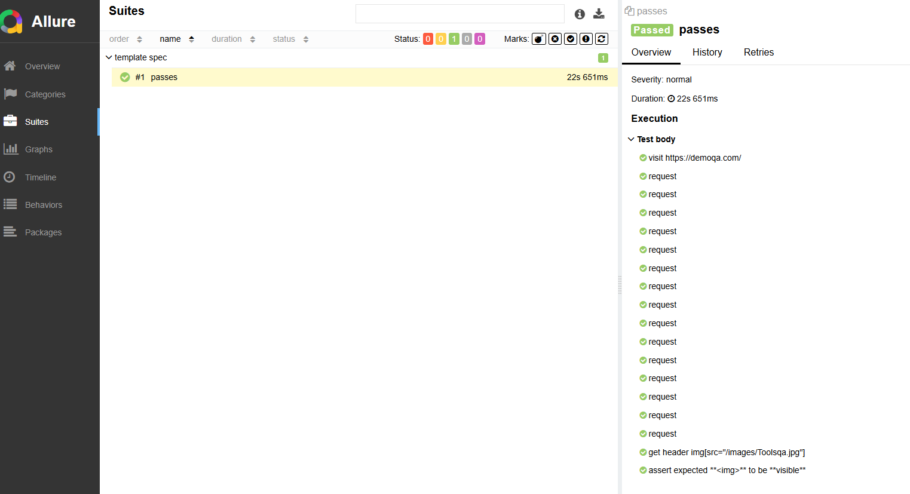

# Cypress template

# Configuração

## Criar um projeto node

```yaml
npm init -y
```

## Instalar o cypress

```yaml
npm install cypress --save-dev
```

## Script to open cypress

**package.json**

```yaml
{
  "name": "qademo-cypress",
  "version": "1.0.0",
  "description": "",
  "main": "index.js",
  "scripts": {
    "test": "echo \"Error: no test specified\" && exit 1",
    "open": "cypress open"
  },
  "keywords": [],
  "author": "",
  "license": "ISC",
  "devDependencies": {
    "cypress": "^14.3.3"
  }
}
```

Command

```bash
npm run open
```

---

# Comandos Básicos

### Acessar uma página

```jsx
cy.visit('https://demoqa.com/')
```

### Selecionar elementos

```jsx
cy.get('input[name="email"]') // Por seletor CSS
cy.get('.btn-primary')        // Por classe
cy.get('#meu-id')             // Por ID
cy.contains('Texto do botão') // Por texto visível
```

### Digitar em campos

```jsx
cy.get('input[name="email"]').type('usuario@email.com')
```

### Clicar em elementos

```jsx
cy.get('button[type="submit"]').click()
```

### Selecionar em dropdowns

```jsx
cy.get('select').select('Opção 1')
```

### Marcar/desmarcar checkbox ou radio

```jsx
cy.get('input[type="checkbox"]').check()
cy.get('input[type="checkbox"]').uncheck()
cy.get('input[type="radio"]').check()
```

## Asserções

### Verificar se elemento existe ou está visível

```jsx
cy.get('.mensagem-sucesso').should('exist')
cy.get('.mensagem-sucesso').should('be.visible')
```

### Verificar texto de um elemento

```jsx
cy.get('.mensagem-sucesso').should('contain', 'Cadastro realizado com sucesso')
```

### Verificar valor de um input

```jsx
cy.get('input[name="email"]').should('have.value', 'usuario@email.com')
```

### Verificar se checkbox está marcado

```jsx
cy.get('input[type="checkbox"]').should('be.checked')
```

## Esperas e Interceptações

### Esperar por um elemento

```jsx
cy.get('.carregando', { timeout: 10000 }).should('not.exist')
```

### Esperar por requisições (API)

```jsx
cy.intercept('GET', '/api/usuarios').as('getUsuarios')
cy.visit('/usuarios')
cy.wait('@getUsuarios')
```

## Comandos de Navegação

### Voltar ou avançar no histórico

```jsx
cy.go('back')
cy.go('forward')
```

### Recarregar a página

```jsx
cy.reload()
```

### Upload de arquivos

```jsx
cy.get('input[type="file"]').selectFile('caminho/para/arquivo.pdf')
```

## Comandos Customizados (Exemplo)

No arquivo `cypress/support/commands.js`:

```jsx
Cypress.Commands.add('login', (email, senha) => {
  cy.visit('/login')
  cy.get('input[name="email"]').type(email)
  cy.get('input[name="senha"]').type(senha)
  cy.get('button[type="submit"]').click()
}
```

Uso no teste:

```jsx
cy.login('usuario@email.com', 'senha123')
```

## Outras Dicas Úteis

- **cy.wait(tempo)**: Evite usar esperas fixas, prefira esperar por elementos ou requisições.
- **cy.screenshot()**: Tira um print da tela.
- **cy.viewport(largura, altura)**: Define o tamanho da tela (útil para testes responsivos).

---

# Execução dos testes

## Comandos

- **`cypress open`**: Abre a interface gráfica do Cypress, permitindo executar testes interativamente.
    
    ```bash
    npx cypress open
    ```
    

- **`cypress run`**: Executa os testes no console, ideal para automação e CI/CD.
    
    ```bash
    npx cypress run
    ```
    
    - **Especificar um arquivo de teste específico:**
        
        ```bash
        npx cypress run --spec "cypress/e2e/meu_teste.cy.js"
        ```
        
    
    - **Executar testes em um navegador específico**
        
        ```bash
        npx cypress run --browser chrome
        ```
        
    
    - **Gravar os resultados em um arquivo (útil para CI/CD):**
        
        ```bash
        npx cypress run --reporter junit --reporter-options "mochaFile=cypress/results/results.xml"
        ```
        
    
    - **Executar testes com tags específicas:**
    Se você usa tags para organizar seus testes, pode executar apenas os testes com uma tag específica:
        
        ```bash
        npx cypress run --env grepTags=@tag_especifica
        ```
        

- Exemplo Completo para CI/CD
    - Um exemplo de comando completo para executar testes em um ambiente de CI/CD poderia ser:
    
    ```bash
    npx cypress run \
      --browser chrome \
      --headless \
      --reporter junit \
      --reporter-options "mochaFile=cypress/results/results.xml"
    ```
    

# Relatórios customizaveis com Allure

cypress-allure-plugin

https://www.npmjs.com/package/@shelex/cypress-allure-plugin

```bash
npm i @shelex/cypress-allure-plugin
```

Adicionar o plugin no arquivo **cypress/support/e2e.js**

```jsx
// ***********************************************************
// This example support/e2e.js is processed and
// loaded automatically before your test files.
//
// This is a great place to put global configuration and
// behavior that modifies Cypress.
//
// You can change the location of this file or turn off
// automatically serving support files with the
// 'supportFile' configuration option.
//
// You can read more here:
// https://on.cypress.io/configuration
// ***********************************************************

// Import commands.js using ES2015 syntax:
import './commands'
import '@shelex/cypress-allure-plugin';
```

Registrar o report no arquivo **cypress.config.js**

```jsx
const { defineConfig } = require("cypress");
const allureWriter = require('@shelex/cypress-allure-plugin/writer');

module.exports = defineConfig({
  e2e: {
    setupNodeEvents(on, config) {
      allureWriter(on, config);
      return config;
    },
  },
});
```

## Executar os teste com allure

```jsx
npx cypress run --env allure=true
```

## Gerar um novo report após execução

```jsx
allure generate --clean
```

## Executar o report

```jsx
allure serve
```



## Atualizar package.json para executar os tests com allure

```jsx
{
  "name": "qademo-cypress",
  "version": "1.0.0",
  "description": "",
  "main": "index.js",
  "scripts": {
    "open": "cypress open",
    "test": "rm -rf allure-results && cypress run --env allure=true",
    "report": "allure generate --clean allure-results -o allure-report && allure open"
  },
  "keywords": [],
  "author": "",
  "license": "ISC",
  "devDependencies": {
    "@shelex/cypress-allure-plugin": "^2.41.1",
    "allure-cypress": "^3.2.2",
    "cypress": "^14.3.3"
  }
}

```

Agora podemos executar **npm run test** e já ter a execução do comando completo, e **npm run report** para criar o report e já executar o mesmo.

Se observarmo o report do Allure vemos que não temos a definição clara dos steps do teste, podemos melhorar isso utilizando alguns recursos. Primeiro vamos atualizar nosso teste utilizando steps:

**cypress/e2e/open_site.cy.js**

```jsx

describe('Home Page Test Suite', () => {
  it('Home page test', () => {
    cy.allure().step('Visit Home Page')
    cy.visit('https://demoqa.com/')
    
    cy.allure().step('Validate home page is loaded successfully')
    cy.get('header img[src="/images/Toolsqa.jpg"]', { timeout: 10000 })
    .should('be.visible')
  })
})
```

Podemos ver agora que a exibição ficou bem melhor:


# Page Object

Vamos implementar uma camada de page object para deixar nosso projeto mais organizado. Crie o arquivo **cypress/support/pages/HomePage.js**

Temos aqui uma classe com métodos para acessar a home page e validar se foi renderizada, exatamente o que tinhamos no teste.

```jsx
export default class HomePage {
  visitHomePage() {
    cy.allure().step('Visit Home Page');
    cy.visit('https://demoqa.com/');
  }

  validateHomePageLoaded() {
    cy.allure().step('Validate home page is loaded successfully');
    cy.get('header img[src="/images/Toolsqa.jpg"]', { timeout: 10000 })
    .should('be.visible')
  }
}
```

Agora no teste podemos utilizar esta classe que criamos.

**cypress/e2e/open_site.cy.js**

```jsx
import HomePage from '../support/pages/HomePage'

describe('Home Page Test Suite', () => {
  let homePage

  before(() => {
    homePage = new HomePage()
  })

  it('Home page test', () => {
    homePage.visitHomePage()
    homePage.validateHomePageLoaded()
  })
})
```

Podemos observar agora que estamos separando responsabilidades, o teste agora chama a classe da home e na classe temos os métodos referentes a home page.

# Utilizar typescript

Iremos configurar nosso projeto para utilizar typescript e assim podemos utilizar tipos em nosso código.

## Instalar dependências

```jsx
npm install --save-dev typescript @types/cypress
```

## Criar arquivo para configurar o typescript

**tsconfig.json**

```jsx
{
  "compilerOptions": {
    "target": "es5",
    "lib": ["es5", "dom"],
    "types": ["cypress"],
    "module": "commonjs",
    "esModuleInterop": true,
    "allowJs": true,
    "baseUrl": ".",
    "paths": {
      "*": ["./*"]
    }
  },
  "include": ["**/*.ts"]
}
```

## Atualizar o arquivo cypress.config.js

```jsx
const { defineConfig } = require("cypress");
const allureWriter = require('@shelex/cypress-allure-plugin/writer');

module.exports = defineConfig({
  e2e: {
    setupNodeEvents(on, config) {
      allureWriter(on, config);
      return config;
    },
    chromeWebSecurity: false,
    defaultCommandTimeout: 60000,
    pageLoadTimeout: 60000,
    viewportWidth: 1920,
    viewportHeight: 1080,
    screenshotsFolder: "cypress/screenshots",
    videosFolder: "cypress/videos",
    trashAssetsBeforeRuns: true,
    video: false,
    retries: {
      runMode: 2,
      openMode: 0,
    },
  },
});

```

## Atualizar o arquivo Homepage para extensão ts

cypress/support/pages/HomePage.ts

```jsx
export default class HomePage {
  visitHomePage() {
    cy.allure().logStep('Visit Home Page');
    cy.visit('https://demoqa.com/');
  }

  validateHomePageLoaded() {
    cy.allure().logStep('Validate home page is loaded successfully');
    cy.get('header img[src="/images/Toolsqa.jpg"]', { timeout: 10000 })
    .should('be.visible')
  }
}
```

## Atualizar o arquivo de teste para extensão ts

**cypress/e2e/open_site.cy.ts**

```jsx
import HomePage from '../support/pages/HomePage'

describe('Home Page Test Suite', () => {
  let homePage: HomePage

  before(() => {
    homePage = new HomePage()
  })

  it('Home page test', () => {
    homePage.visitHomePage()
    homePage.validateHomePageLoaded()
  })
})
```

Todos demais arquivos do projetos também devem ser alterados para .ts. A partir de agora não utilizaremos mais .js

**cypress/support/commands.ts**

**cypress/support/e2e.ts**

---

# Definir vários ambientes de testes

Vamos criar uma estrutura para que possamos rodar os testes em diferentes URLs com base nos ambientes de testes que desejamos.

## Definir as urls de cada ambiente

No arquivo **cypress.config.ts** vamos definir as URLs

```jsx
import { defineConfig } from "cypress";
import allureWriter from '@shelex/cypress-allure-plugin/writer';

const urls = {
  uat: 'https://demoqa.com/',
  rc: 'https://demoqa.com/',
  prod: 'https://demoqa.com/'
};

module.exports = defineConfig({
  e2e: {
    setupNodeEvents(on, config) {
      allureWriter(on, config);
      const environment = config.env.ENV || 'uat';
      config.baseUrl = urls[environment];
      return config;
    },
    chromeWebSecurity: false,
    defaultCommandTimeout: 60000,
    pageLoadTimeout: 60000,
    viewportWidth: 1920,
    viewportHeight: 1080,
    screenshotsFolder: "cypress/screenshots",
    videosFolder: "cypress/videos",
    trashAssetsBeforeRuns: true,
    video: false,
    retries: {
      runMode: 2,
      openMode: 0,
    },
  },
});
```

Vamos agora criar os scripts para cada ambiente no **package.json**

```jsx
{
  "name": "qademo-cypress",
  "version": "1.0.0",
  "description": "",
  "main": "index.js",
  "scripts": {
    "open": "cypress open",
    "test": "rm -rf allure-results && cypress run --env ENV=uat,allure=true",
    "test:rc": "rm -rf allure-results && cypress run --env ENV=rc,allure=true",
    "test:prod": "rm -rf allure-results && cypress run --env ENV=prod,allure=true",
    "report": "allure generate --clean allure-results -o allure-report && allure open"
  },
  "keywords": [],
  "author": "",
  "license": "ISC",
  "devDependencies": {
    "@shelex/cypress-allure-plugin": "^2.41.1",
    "@types/cypress": "^1.1.6",
    "allure-cypress": "^3.2.2",
    "cypress": "^14.3.3",
    "typescript": "^5.8.3"
  }
}
```

Com isso utilizamos as variaveis de ambiente para definir cada execução tendo o ambiente de uat como o default.

No arquivo **cypress/support/pages/HomePage.ts** agora podemos definir somente / como nossa url

```jsx
export default class HomePage {
  visitHomePage() {
    cy.allure().logStep('Visit Home Page');
    cy.visit('/');
  }

  validateHomePageLoaded() {
    cy.allure().logStep('Validate home page is loaded successfully');
    cy.get('header img[src="/images/Toolsqa.jpg"]', { timeout: 10000 })
    .should('be.visible')
  }
}
```

---

# Database Conection

Utilizaremos um arquivo docker compose para executar um banco de dados local e assim conectarmos no mesmo, em nosso caso vamos utilizar o mysql.

**docker-compose.yml**

```yaml
services:
  mysql:
    image: mysql:latest
    container_name: cypress-mysql-test
    ports:
      - "3306:3306"
    environment:
      MYSQL_ROOT_PASSWORD: ${MYSQL_ROOT_PASSWORD}
      MYSQL_DATABASE: ${MYSQL_DATABASE}
      MYSQL_USER: ${MYSQL_USER}
      MYSQL_PASSWORD: ${MYSQL_PASSWORD}
    volumes:
      - mysql_data:/var/lib/mysql
    healthcheck:
      test: ["CMD", "mysqladmin", "ping", "-h", "localhost"]
      interval: 5s
      timeout: 3s
      retries: 5

volumes:
  mysql_data:
```

Vamos criar um arquivo .env para conter as variáveis de ambiente para conexão ao banco de dados.

**.env**

```bash
MYSQL_ROOT_PASSWORD=rootpassword
MYSQL_DATABASE=testdb
MYSQL_USER=testuser
MYSQL_PASSWORD=testpassword

DB_NAME=testdb
DB_USER=testuser
DB_PASSWORD=testpassword
DB_HOST=localhost
DB_PORT=3306
```

Precisamos de dados no banco para nosso teste então vamos usar um recurso onde criamos um arquivo init.sql para popular nosso banco. Ele cria a base de dados, cria a tabela e inseri dados.

**init.sql**

```sql
CREATE DATABASE IF NOT EXISTS testdb;

USE testdb;

CREATE TABLE IF NOT EXISTS users (
    id INT AUTO_INCREMENT PRIMARY KEY,
    username VARCHAR(50) NOT NULL,
    email VARCHAR(100) NOT NULL,
    password VARCHAR(255) NOT NULL
);

INSERT INTO users (username, email, password) VALUES
('user1', 'user1@example.com', 'password123'),
('user2', 'user2@example.com', 'password123'),
('user3', 'user3@example.com', 'password123'),
('user4', 'user4@example.com', 'password123'),
('user5', 'user5@example.com', 'password123'),
('user6', 'user6@example.com', 'password123'),
('user7', 'user7@example.com', 'password123'),
('user8', 'user8@example.com', 'password123'),
('user9', 'user9@example.com', 'password123'),
('user10', 'user10@example.com', 'password123');
```

Quando executarmos o docker compose estaremos iniciando um container com o database.

`docker-compose up -d`

Criamos um script python para conectar ao banco, executar o init.sql e criar dados para utilizarmos nos testes.

**init_db.py**

```sql
"""
Database Initialization Script

This enhanced script initializes a MySQL database with:
- Robust connection handling with retry mechanism
- Proper transaction management
- Detailed logging
- Environment variable support
- Configurable parameters
- Type hints and documentation
"""

import os
import time
from pathlib import Path
from typing import Optional

import mysql.connector
from dotenv import load_dotenv

# Load environment variables from .env file
load_dotenv()

class DatabaseInitializer:
    """
    A robust database initializer that creates and configures a MySQL database.

    Args:
        host (str): Database server host.
        user (str): Database username.
        password (str): Database password.
        database (str): Database name.
        init_file (str): Path to SQL initialization file. Defaults to 'init.sql'
        timeout (int): Connection timeout in seconds. Defaults to 60
        interval (int): Retry interval in seconds. Defaults to 5
    """

    def __init__(
        self,
        host: str = "",
        user: str = "",
        password: str = "",
        database: str = "",
        init_file: str = "init.sql",
        timeout: int = 60,
        interval: int = 5
    ):
        self.host = os.getenv("DB_HOST", host)
        self.user = os.getenv("DB_USER", user)
        self.password = os.getenv("DB_PASSWORD", password)
        self.database = os.getenv("DB_NAME", database)
        self.init_file = Path(init_file)
        self.timeout = timeout
        self.interval = interval
        self.connection: Optional[mysql.connector.MySQLConnection] = None

    def initialize(self) -> bool:
        """
        Main initialization method that handles the complete process.

        Returns:
            bool: True if initialization succeeded, False otherwise
        """
        try:
            if not self._connect_with_retry():
                return False

            if not self._execute_init_script():
                return False

            return True

        except Exception as e:
            print(f"⛔ Critical error during initialization: {e}")
            return False
        finally:
            self._close_connection()

    def _connect_with_retry(self) -> bool:
        """
        Attempts to connect to the database with retry logic.

        Returns:
            bool: True if connection succeeded, False if timeout reached
        """
        start_time = time.time()
        attempts = 0

        while (time.time() - start_time) < self.timeout:
            attempts += 1
            try:
                print(f"Attempt #{attempts}: Connecting to MySQL at {self.host}...")
                self.connection = mysql.connector.connect(
                    host=self.host,
                    user=self.user,
                    password=self.password,
                    database=self.database,
                    connect_timeout=5
                )

                if self.connection.is_connected():
                    print(f"✅ Successfully connected to database '{self.database}'")
                    return True

            except mysql.connector.Error as e:
                print(f"⚠️ Connection attempt failed: {e}")
                time.sleep(self.interval)
                continue

        print(f"⛔ Timeout after {self.timeout} seconds. Could not connect to database.")
        return False

    def _execute_init_script(self) -> bool:
        """
        Executes the SQL initialization script.

        Returns:
            bool: True if script executed successfully, False otherwise
        """
        if not self.connection or not self.connection.is_connected():
            print("⛔ No active database connection")
            return False

        if not self.init_file.exists():
            print(f"⛔ Initialization file not found: {self.init_file}")
            return False

        try:
            with open(self.init_file, 'r') as file:
                sql_commands = file.read()

            if not sql_commands.strip():
                print("⚠️ Initialization file is empty")
                return True  # Considered success with no commands

            with self.connection.cursor() as cursor:
                # Execute each command separately
                for command in sql_commands.split(';'):
                    command = command.strip()
                    if command:
                        try:
                            cursor.execute(command)
                        except mysql.connector.Error as e:
                            print(f"⚠️ Error executing command: {command}\nError: {e}")
                            continue

                self.connection.commit()
                print("✅ Database initialized successfully")
                return True

        except Exception as e:
            print(f"⛔ Error executing initialization script: {e}")
            self.connection.rollback()
            return False

    def _close_connection(self) -> None:
        """Closes the database connection if it exists."""
        if self.connection and self.connection.is_connected():
            self.connection.close()
            print("✅ Database connection closed")

if __name__ == "__main__":
    # Example usage
    initializer = DatabaseInitializer(
        host="127.0.0.1",
        user="testuser",
        password="testpassword",
        database="testdb",
        init_file="init.sql",
        timeout=60,
        interval=5
    )

    if initializer.initialize():
        print("🚀 Database initialization completed successfully")
        exit(0)
    else:
        print("❌ Database initialization failed")
        exit(1)
```

Dado que estamos com o container em execução, podemos executar o script e assim o banco estará populado com dados para teste.

Antes de executar precisamos instalar o conector do mysql.

```bash
python -m pip install mysql-connector-python
```

E também o dotenv

```bash
 python -m pip install python-dotenv
```

Agora executamos o script e nosso banco será populado.

`python init_db.py`

## Database Manager

Vamos criar uma forma de controlar nossa conexão com o banco durante os testes e executar scripts sql.

### Instale as dependências

```bash
npm install mysql2
npm install dotenv
```

**cypress/plugins/databaseManager.ts**

```tsx
import mysql, { Connection, RowDataPacket } from 'mysql2/promise';
import fs from 'fs';

type DBConfig = {
  DB_HOST: string;
  DB_PORT: number;
  DB_NAME: string;
  DB_USER: string;
  DB_PASSWORD: string;
};

export class DatabaseManager {
  private config: DBConfig;
  private connection: Connection | null = null;
  private TIMEOUT = 60_000; // ms
  private INTERVAL = 5_000; // ms

  constructor(dbConfig: DBConfig) {
    this.config = dbConfig;
  }
  
  async connect(): Promise<void> {
    const start = Date.now();
    while (Date.now() - start < this.TIMEOUT) {
      try {
        this.connection = await mysql.createConnection({
          host: this.config.DB_HOST,
          port: this.config.DB_PORT,
          user: this.config.DB_USER,
          password: this.config.DB_PASSWORD,
          database: this.config.DB_NAME,
          connectTimeout: 5_000,
        });
        return;
      } catch (err) {
        console.log(`Connection attempt failed: ${err}`);
        await new Promise(res => setTimeout(res, this.INTERVAL));
      }
    }
    throw new Error('Failed to connect to database after timeout');
  }

  async executeScript(scriptPath: string): Promise<any[]> {
    if (!this.connection) throw new Error('Not connected');
    const sql = fs.readFileSync(scriptPath, 'utf-8').trim();
    if (!sql) throw new Error('Script file is empty');
    const [rows] = await this.connection.query<RowDataPacket[]>(sql);
    return Array.isArray(rows) ? rows : [];
  }

  async replaceValuesAndExecuteScript(scriptPath: string, values: string[]): Promise<{modifiedSql: string, rows: any[]}> {
    if (!this.connection) throw new Error('Not connected');
    let sql = fs.readFileSync(scriptPath, 'utf-8').trim();
    
    // Substituir os placeholders
    let i = 0;
    const modifiedSql = sql.replace(/\$\$/g, () => {
      if (i < values.length) {
        return values[i++];
      }
      return '$$'; // Manter placeholders não substituídos
    });
    
    const [rows] = await this.connection.query<RowDataPacket[]>(modifiedSql);
    return {
      modifiedSql,
      rows: Array.isArray(rows) ? rows : []
    };
  }

  async closeConnection(): Promise<void> {
    if (this.connection) {
      await this.connection.end();
      this.connection = null;
    }
  }
}

```

Vamos utilizar o recurso de tasks do cypress para facilitar a utilização do DatabaseManager. No arquivo **cypress.config.ts** vamos criar as tasks referentes aos methodos do banco de dados.

**cypress.config.ts**

```tsx
import fs from 'fs';
import 'dotenv/config';
import { defineConfig } from "cypress";
import allureWriter from '@shelex/cypress-allure-plugin/writer';
import { DatabaseManager } from "./cypress/plugins/databaseManager";

// Configurações de ambiente
const urls = {
  uat: 'https://demoqa.com/',
  rc: 'https://demoqa.com/',
  prod: 'https://demoqa.com/'
};

// Configuração do banco de dados
const dbConfig = {
  DB_HOST: process.env.DB_HOST || 'localhost',
  DB_PORT: parseInt(process.env.DB_PORT || '3306'),
  DB_NAME: process.env.DB_NAME || 'testdb',
  DB_USER: process.env.DB_USER || 'testuser',
  DB_PASSWORD: process.env.DB_PASSWORD || 'testpassword',
};

// Instância do gerenciador de banco de dados
let db: DatabaseManager | null = null;

export default defineConfig({
  e2e: {
    setupNodeEvents(on, config) {
      // Configuração do Allure
      allureWriter(on, config);
      
      // Configuração do ambiente
      const environment = config.env.ENV || 'uat';
      config.baseUrl = urls[environment];

      // Configuração das tasks de banco de dados
      on('task', {
        async dbConnect() {
          console.log('Connecting to database...');
          try {
            db = new DatabaseManager(dbConfig);
            await db.connect();
            console.log('Database connected successfully');
            return { success: true };
          } catch (error) {
            console.error('Database connection failed:', error);
            return { success: false, error: error.message };
          }
        },
        
        async dbExecuteScript({ scriptPath }) {
          console.log(`Executing SQL script: ${scriptPath}`);
          try {
            if (!db) {
              throw new Error('Database not connected');
            }
            
            // Ler o SQL do arquivo
            const sql = fs.readFileSync(scriptPath, 'utf-8').trim();
            if (!sql) {
              throw new Error('Script file is empty');
            }
            
            // Executar o SQL
            const rows = await db.executeScript(scriptPath);
            
            return {
              success: true,
              sql,
              rows
            };
          } catch (error) {
            console.error('SQL execution failed:', error);
            return { success: false, error: error.message };
          }
        },
        
        async dbReplaceAndExecute({ scriptPath, values }) {
          console.log(`Executing SQL script with replacements: ${scriptPath}`);
          try {
            if (!db) {
              throw new Error('Database not connected');
            }
            
            // Ler o SQL original
            const originalSql = fs.readFileSync(scriptPath, 'utf-8').trim();
            if (!originalSql) {
              throw new Error('Script file is empty');
            }
            
            // Executar com substituições
            const result = await db.replaceValuesAndExecuteScript(scriptPath, values);
            
            return {
              success: true,
              originalSql,
              modifiedSql: result.modifiedSql,
              rows: result.rows
            };
          } catch (error) {
            console.error('SQL execution with replacements failed:', error);
            return { success: false, error: error.message };
          }
        },
        
        async dbClose() {
          console.log('Closing database connection...');
          try {
            if (db) {
              await db.closeConnection();
              db = null;
              console.log('Database connection closed successfully');
            } else {
              console.log('No database connection to close');
            }
            return { success: true };
          } catch (error) {
            console.error('Error closing database:', error);
            return { success: false, error: error.message };
          }
        },
      });

      return config;
    },
    chromeWebSecurity: false,
    defaultCommandTimeout: 60000,
    pageLoadTimeout: 60000,
    viewportWidth: 1920,
    viewportHeight: 1080,
    screenshotsFolder: "cypress/screenshots",
    videosFolder: "cypress/videos",
    trashAssetsBeforeRuns: true,
    video: false,
    retries: {
      runMode: 2,
      openMode: 0,
    },
  },
});
```

Para ficar ainda melhor podemos criar commands para cada uma das tasks.

**cypress.config.ts**

```tsx
// ***********************************************
// This example commands.js shows you how to
// create various custom commands and overwrite
// existing commands.
//
// For more comprehensive examples of custom
// commands please read more here:
// https://on.cypress.io/custom-commands
// ***********************************************
//
//
// -- This is a parent command --
// Cypress.Commands.add('login', (email, password) => { ... })
//
//
// -- This is a child command --
// Cypress.Commands.add('drag', { prevSubject: 'element'}, (subject, options) => { ... })
//
//
// -- This is a dual command --
// Cypress.Commands.add('dismiss', { prevSubject: 'optional'}, (subject, options) => { ... })
//
//
// -- This will overwrite an existing command --
// Cypress.Commands.overwrite('visit', (originalFn, url, options) => { ... })

Cypress.Commands.add('dbConnect', () => {
  cy.allure().startStep('Connect to Database');
  cy.task('dbConnect').then((result: any) => {
    if (result.success) {
      cy.allure().logStep('Database connected successfully');
    } else {
      cy.allure().logStep(`Database connection failed: ${result.error}`);
      cy.allure().attachment('Error', result.error ?? 'Erro desconhecido', 'text/plain');
      throw new Error(result.error);
    }
    cy.allure().endStep();
  });
});

Cypress.Commands.add('dbClose', () => {
  cy.allure().startStep('Close Database Connection');
  cy.task('dbClose').then(() => {
    cy.allure().endStep();
  });
});

Cypress.Commands.add('dbExecuteScript', (scriptPath: string) => {
  return cy.task('dbExecuteScript', { scriptPath }).then((result: any) => {
    if (result.success) {
      expect(result.rows).to.be.an('array');
      return result.rows;
    } else {
      throw new Error(result.error);
    }
  });
});

Cypress.Commands.add('dbReplaceAndExecute', (scriptPath: string, values: any[]) => {
  return cy.task('dbReplaceAndExecute', { scriptPath, values }).then((result: any) => {
    if (result.success) {
      expect(result.rows).to.be.an('array');
      return result.rows; 
    } else {
      throw new Error(result.error);
    }
  });
});

```

Precisaremos criar algumas interfaces para que o typescript consiga tipar as tasks.

**cypress/support/index.d.ts**

```tsx
declare namespace Cypress {
  interface Chainable<Subject = any> {
    dbConnect(): Chainable<void>;
    dbClose(): Chainable<void>;
    dbExecuteScript(scriptPath: string): Chainable<any[]>;
    dbReplaceAndExecute(scriptPath: string, values: any[]): Chainable<any[]>;
  }
}

```

Vamos agora criar arquivos .sql para que possamos fazer tests que lêem os arquivos e executam os mesmos.

**cypress/sql/test.sql**

```sql
SELECT * FROM users;
```

**cypress/sql/users_replace.sql**

```sql
SELECT * FROM users LIMIT $$;
```

Este exemplo de script tem por objetivo exemplificar a utilização do command **cy.dbReplaceAndExecute** onde podemos passar um valor para que aconteça o replace onde estiver o \`\$\$\` Um exemplo seria executar algo como **cy.dbReplaceAndExecute('cypress/sql/users_replace.sql', [’users’, 1]);** onde o primeiro \`\$\$\` será alterado para users, e o segundo para 1 ficando o script como **SELECT * FROM users LIMIT 1;**

Lembrando que podemos utilizar quantos \`\$\$\` necessários pois a função recebe um array e vai alterar cada um dos elementos conforme os itens do array.

Agora podemos criar nosso teste executar as tasks pelos commands deixando muito mais simples.

**cypress/e2e/database.cy.ts**

```sql
describe('Test DB', () => {
  beforeEach(() => {
    cy.dbConnect();
  });

  afterEach(() => {
    cy.dbClose();
  });

  it('executa script SQL', () => {
    cy.dbExecuteScript('cypress/sql/test.sql');
  });

  it('executa script com replace', () => {
    cy.dbReplaceAndExecute('cypress/sql/users_replace.sql', ['users', 1]);
  });
});
```

Podemos ver a execução do teste conectando no banco e retornando os valores.

Podemos utilizar alguns recursos para deixar a conexão com o banco mais isolada ainda. Podemos configurar para conectar o banco no arquivo **cypress/support/e2e.ts** e assim não precisamos configurar em cada suite de tests pois já executa automaticamente antes das suites.

**cypress/support/e2e.ts**

```sql
// ***********************************************************
// This example support/e2e.js is processed and
// loaded automatically before your test files.
//
// This is a great place to put global configuration and
// behavior that modifies Cypress.
//
// You can change the location of this file or turn off
// automatically serving support files with the
// 'supportFile' configuration option.
//
// You can read more here:
// https://on.cypress.io/configuration
// ***********************************************************

// Import commands.js using ES2015 syntax:
import './commands'
import '@shelex/cypress-allure-plugin';

before(() => {
  cy.dbConnect();
});

after(() => {
  cy.dbClose();
});
```

Agora temos somente a execução dos testes e não precisamos conectar ao banco no arquivo de testes

```sql
describe('Test DB', () => {
  it('executa script SQL', () => {
    cy.dbExecuteScript('cypress/sql/test.sql');
  });

  it('executa script com replace', () => {
    cy.dbReplaceAndExecute('cypress/sql/users_replace.sql', ['users', 1]);
  });
});
```

Esta é uma opção porém precisamos ver se faz sentido em nosso projeto, pode ser que dependendo do contexto seja necessário conectar ao banco em cada suite ou teste.

Para termos acesso ao resultado retornado pelo banco de dados podemos fazer da seguinte forma.

**cypress/e2e/database.cy.ts**

```sql
describe('Test DB', () => {
  it('executa script SQL', () => {
    cy.dbExecuteScript('cypress/sql/test.sql').then((users) => {
      expect(users).to.be.an('array');
      expect(users.length).to.be.greaterThan(0);
      cy.log(`Primeiro usuário: ${users[0].name}`);
    });
  });

  it('executa script com replace', () => {
    cy.dbReplaceAndExecute('cypress/sql/users_replace.sql', ['users', 1]).then((user) => {
      expect(user[0].id).to.equal(1);
      cy.log(`User: ${user[0].name}`);
    });
  });
});
```

# Interagindo com API

Vamos instalar um plugin para facilitar a visualização dos resultados

```sql
npm i cypress-plugin-api
```

## Registrar o plugin

**cypress\support\e2e.ts**

```sql
// ***********************************************************
// This example support/e2e.js is processed and
// loaded automatically before your test files.
//
// This is a great place to put global configuration and
// behavior that modifies Cypress.
//
// You can change the location of this file or turn off
// automatically serving support files with the
// 'supportFile' configuration option.
//
// You can read more here:
// https://on.cypress.io/configuration
// ***********************************************************

// Import commands.js using ES2015 syntax:
import './commands'
import '@shelex/cypress-allure-plugin';
import 'cypress-plugin-api'

Cypress.on('uncaught:exception', (err, runnable) => {
  // Retorne false para evitar que o Cypress falhe o teste
  return false;
});

before(() => {
  cy.dbConnect();
});

after(() => {
  cy.dbClose();
});
```

## Swagger da API que utilizaremos de exemplo

[Swagger UI](https://demoqa.com/swagger/#/)

Na pasta suport vamos criar uma pasta api e adicionar um arquivo de tipagem para faciliar nos testes. Nele nos criamos interfaces para validar coisas como a resposta da api e etc…

**cypress\support\api\types.ts**

```sql
export interface User {
  userName: string;
  password: string;
  userId?: string;
}

export interface Book {
  isbn: string;
  title: string;
  subTitle: string;
  author: string;
  publish_date: string;
  publisher: string;
  pages: number;
  description: string;
  website: string;
}

export interface TokenResponse {
  token: string;
  expires: string;
  status: string;
  result: string;
}

export interface BooksResponse {
  books: Book[];
}

export interface ApiHeaders {
  accept: string;
  'Content-Type': string;
  Authorization?: string;
}

```

Vamos utilizar uma library para criar dados fake.

[FakerJS](https://fakerjs.dev/guide/)

```sql
npm install @faker-js/faker --save-dev
```

Dentro da pasta suport vamos criar uma pasta utils e um arquivo para criar os dados fakes:

**cypress\support\utils\faker.utils.ts**

```sql
import { faker } from '@faker-js/faker';
import { User } from '../api/types';

/**
 * Cria dados de usuário fake para testes
 * @returns Objeto com userName e password aleatórios
 */
export function createFakeUser(): User {
  return {
    userName: faker.internet.userName(),
    password: faker.internet.password({
      length: 12,
      memorable: false,
      pattern: /[A-Za-z0-9]/,
      prefix: '!Aa1'
    })
  };
}

/**
 * Gera um ISBN fake (apenas para exemplo)
 * @returns String com formato de ISBN
 */
export function createFakeISBN(): string {
  return faker.string.numeric(13);
}
```

Vamos agora criar um arquivo para com os métodos referentes a API e utilizar a tipagem que criamos anteriormente.

**cypress\support\api\bookstore.api.ts**

```sql
import { User, ApiHeaders, TokenResponse, BooksResponse, Book } from './types';

const DEMOQA_URL = 'https://demoqa.com';

const ENDPOINTS = {
  CREATE_ACCOUNT: `${DEMOQA_URL}/Account/v1/User`,
  GENERATE_TOKEN: `${DEMOQA_URL}/Account/v1/GenerateToken`,
  USER_AUTHORIZED: `${DEMOQA_URL}/Account/v1/Authorized`,
  DELETE_USER: `${DEMOQA_URL}/Account/v1/User/`,
  LIST_BOOKS: `${DEMOQA_URL}/BookStore/v1/Books`,
  LIST_BOOKS_ISBN: `${DEMOQA_URL}/BookStore/v1/Book?ISBN=`
};

export const getHeaders = (token?: string): ApiHeaders => {
  const headers: ApiHeaders = {
    accept: 'application/json',
    'Content-Type': 'application/json'
  };

  if (token) {
    headers.Authorization = `Bearer ${token}`;
  }

  return headers;
};

/**
 * Cria uma conta de usuário
 * @param user Dados do usuário (userName, password)
 * @returns Resposta da API com userId
 */
export const createUserAccount = (user: User): Cypress.Chainable<Cypress.Response<any>> => {
  return cy.api({
    method: 'POST',
    url: ENDPOINTS.CREATE_ACCOUNT,
    headers: getHeaders(),
    body: user,
    failOnStatusCode: false // Para capturar status 201
  });
};

/**
 * Gera um token para o usuário
 * @param user Dados do usuário (userName, password)
 * @returns Resposta da API com token
 */
export const generateUserToken = (user: User): Cypress.Chainable<Cypress.Response<TokenResponse>> => {
  return cy.api({
    method: 'POST',
    url: ENDPOINTS.GENERATE_TOKEN,
    headers: getHeaders(),
    body: user
  });
};

/**
 * Verifica se o usuário está autorizado
 * @param user Dados do usuário (userName, password)
 * @returns Resposta da API com status de autorização
 */
export const checkUserAuthorized = (user: User): Cypress.Chainable<Cypress.Response<boolean>> => {
  return cy.api({
    method: 'POST',
    url: ENDPOINTS.USER_AUTHORIZED,
    headers: getHeaders(),
    body: user
  });
};

/**
 * Lista todos os livros disponíveis
 * @returns Resposta da API com lista de livros
 */
export const listAllBooks = (): Cypress.Chainable<Cypress.Response<BooksResponse>> => {
  return cy.api({
    method: 'GET',
    url: ENDPOINTS.LIST_BOOKS,
    headers: getHeaders()
  });
};

/**
 * Busca um livro pelo ISBN
 * @param isbn ISBN do livro
 * @returns Resposta da API com detalhes do livro
 */
export const getBookByISBN = (isbn: string): Cypress.Chainable<Cypress.Response<Book>> => {
  return cy.api({
    method: 'GET',
    url: `${ENDPOINTS.LIST_BOOKS_ISBN}${isbn}`,
    headers: getHeaders()
  });
};

/**
 * Deleta um usuário
 * @param userId ID do usuário
 * @param token Token de autenticação
 * @returns Resposta da API
 */
export const deleteUser = (userId: string, token: string): Cypress.Chainable<Cypress.Response<any>> => {
  return cy.api({
    method: 'DELETE',
    url: `${ENDPOINTS.DELETE_USER}${userId}`,
    headers: getHeaders(token),
    failOnStatusCode: false
  });
};

```

Agora podemos criar nosso arquivo de teste realmente e utilizar os métodos que criamos.

```sql
import { createFakeUser } from '../support/utils/faker.utils';
import { 
  createUserAccount, 
  generateUserToken, 
  checkUserAuthorized, 
  listAllBooks, 
  getBookByISBN, 
  deleteUser 
} from '../support/api/bookstore.api';
import { User } from '../support/api/types';

describe('Book Store API', () => {
  // Dados de teste
  const testUser: User = createFakeUser();
  let userToken: string;
  
  // Dados de livro para validação
  const expectedBook = {
    isbn: '9781449365035',
    title: 'Speaking JavaScript',
    subTitle: 'An In-Depth Guide for Programmers',
    author: 'Axel Rauschmayer',
    publisher: 'O\'Reilly Media'
  };

  it('You must create a user', () => {
    createUserAccount(testUser).then((response) => {
      expect(response.status).to.eq(201);
      expect(response.body.userID).to.be.a('string');
      
      // Salva o userId para uso posterior
      testUser.userId = response.body.userID;
    });
  });

  it('Must generate a token for the user', () => {
    generateUserToken(testUser).then((response) => {
      expect(response.status).to.eq(200);
      expect(response.body.token).to.be.a('string');
      expect(response.body.expires).to.be.a('string');
      
      // Salva o token para uso posterior
      userToken = response.body.token;
    });
  });

  it('Must authorize the user', () => {
    checkUserAuthorized(testUser).then((response) => {
      expect(response.status).to.eq(200);
      expect(response.body).to.be.true;
    });
  });

  it('Must list all books', () => {
    listAllBooks().then((response) => {
      expect(response.status).to.eq(200);
      expect(response.body.books).to.be.an('array').that.is.not.empty;
      
      // Verifica se o livro esperado está na lista
      const foundBook = response.body.books.find(book => book.isbn === expectedBook.isbn);
      expect(foundBook).to.exist;
    });
  });

  it('You must search for a book by ISBN', () => {
    getBookByISBN(expectedBook.isbn).then((response) => {
      expect(response.status).to.eq(200);
      expect(response.body.isbn).to.eq(expectedBook.isbn);
      expect(response.body.title).to.eq(expectedBook.title);
      expect(response.body.subTitle).to.eq(expectedBook.subTitle);
      expect(response.body.author).to.eq(expectedBook.author);
      expect(response.body.publisher).to.eq(expectedBook.publisher);
    });
  });

  // Limpeza - executado após todos os testes
  after(() => {
    // Só tenta deletar se tiver userId e token
    if (testUser.userId && userToken) {
      deleteUser(testUser.userId, userToken).then((response) => {
        expect([200, 204]).to.include(response.status);
      });
    }
  });
});

```

Acima temos um exemplo de como realizar requisições para uma API e validar o retorno das mesmas.

